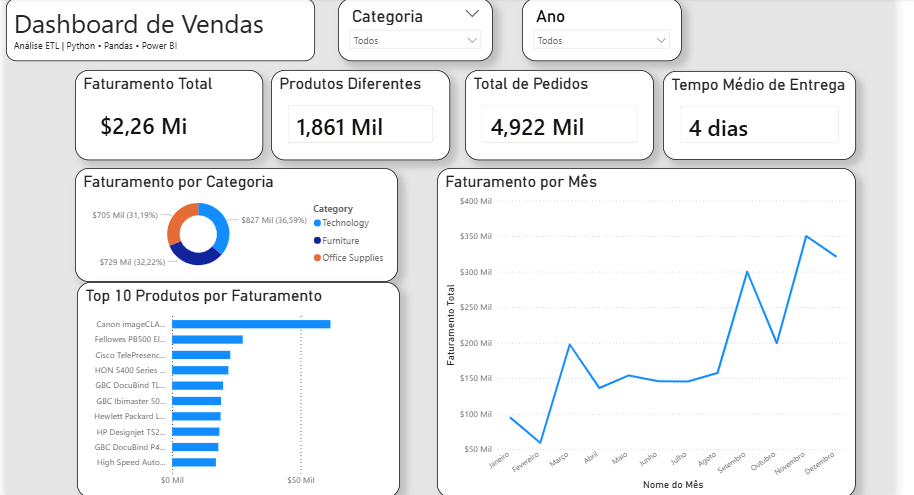

# Pipeline ETL de Vendas com Python, Pandas e Power BI

## 📌 Sobre o projeto

Este projeto consiste em um pipeline ETL (Extract, Transform, Load) desenvolvido em Python para tratamento e análise de dados de vendas.

O objetivo é transformar um arquivo CSV bruto em uma base de dados limpa, gerar novas informações e criar um relatório de vendas automaticamente.

---

## 🚀 Tecnologias utilizadas

- Python
- Pandas
- PowerBi
- Git/GitHub
- Ambiente virtual (venv)

---

## 📂 Estrutura do projeto

```text
projeto_etl-vendas/

├── main.py

├── src/
│   ├── extract.py
│   ├── transform.py
│   ├── load.py
│   ├── analysis.py
│   └── report.py

├── data/
│   ├── entrada/
│   │   └── superstore.csv
│   │
│   └── saida/
│       ├── superstore_tratado.csv
│       └── relatorio_vendas.txt

└── requirements.txt
```

---

## 🔄 Funcionamento do ETL

### 1. Extract

Realiza a leitura do arquivo CSV de entrada.

Arquivo utilizado:

```text
data/entrada/superstore.csv
```

---

### 2. Transform

Durante essa etapa são realizadas:

- Tratamento de valores vazios;
- Conversão de datas;
- Criação da coluna Year;
- Criação da coluna Month;
- Cálculo do tempo de entrega (`Delivery Days`);
- Validação dos dados.

---

### 3. Load

Após o tratamento, os dados são salvos em:

```text
data/saida/superstore_tratado.csv
```

---

### 4. Analysis

O projeto realiza análises como:

- Faturamento total;
- Faturamento por categoria;
- Categoria com maior faturamento;
- Top 10 produtos por faturamento.

---

### 5. Report

Ao final é gerado automaticamente:

```text
data/saida/relatorio_vendas.txt
```

Contendo um resumo das principais informações encontradas.

---

## 📈 Resultados do processamento

- 9.800 registros analisados;
- 18 colunas processadas;
- Tratamento de valores nulos;
- Conversão e criação de métricas temporais;
- Validação de dados duplicados.

---

## ▶️ Como executar o projeto

Clone o repositório:

```bash
git clone https://github.com/DenerL/projeto-etl-vendas.git
```

Instale as dependências:

```bash
pip install -r requirements.txt
```

Execute:

```bash
python main.py
```

---

## 📊 Exemplo de resultado

```text
Faturamento Total: R$ 2.261.536,78

Categoria com maior faturamento:
Technology: R$ 827.455,87

Top 10 Produtos:

1. Canon imageCLASS 2200 Advanced Copier
2. Fellowes PB500 Electric Punch Plastic Comb Binding Machine
3. Cisco TelePresence System EX90 Videoconferencing Unit
```

---

## Dashboard



---

## 👨‍💻 Autor

Dener Lucas
